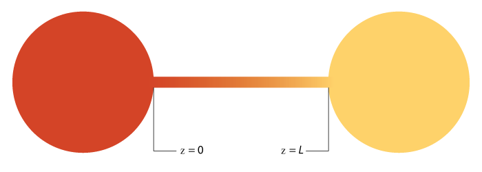

+++
title = "Diffusion Javascript Educational App"
date = 2019-06-13T13:18:43-07:00
draft = false

# Tags: can be used for filtering projects.
# Example: `tags = ["machine-learning", "deep-learning"]`
tags = ["Numerical Simulations"]

# Project summary to display on homepage.
summary = "An interactive online application for teaching the principles of diffusion."

+++

https://sutherland.che.utah.edu/teaching/educational-apps/1-d-diffusion-with-reaction/

