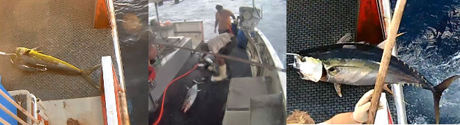

+++
title = "Classifying Fish Special with CNNs"
date = 2019-06-13T13:24:49-07:00
draft = false

# Tags: can be used for filtering projects.
# Example: `tags = ["machine-learning", "deep-learning"]`
tags = ["Machine Learning"]

# Project summary to display on homepage.
summary = "Used convolutional neural network to classify fish species from fishing vessel images."

+++
http://cs229.stanford.edu/proj2016/report/FrostGeislerMahajan-MonitoringIllegalFishingThroughImageClassification-report.pdf

