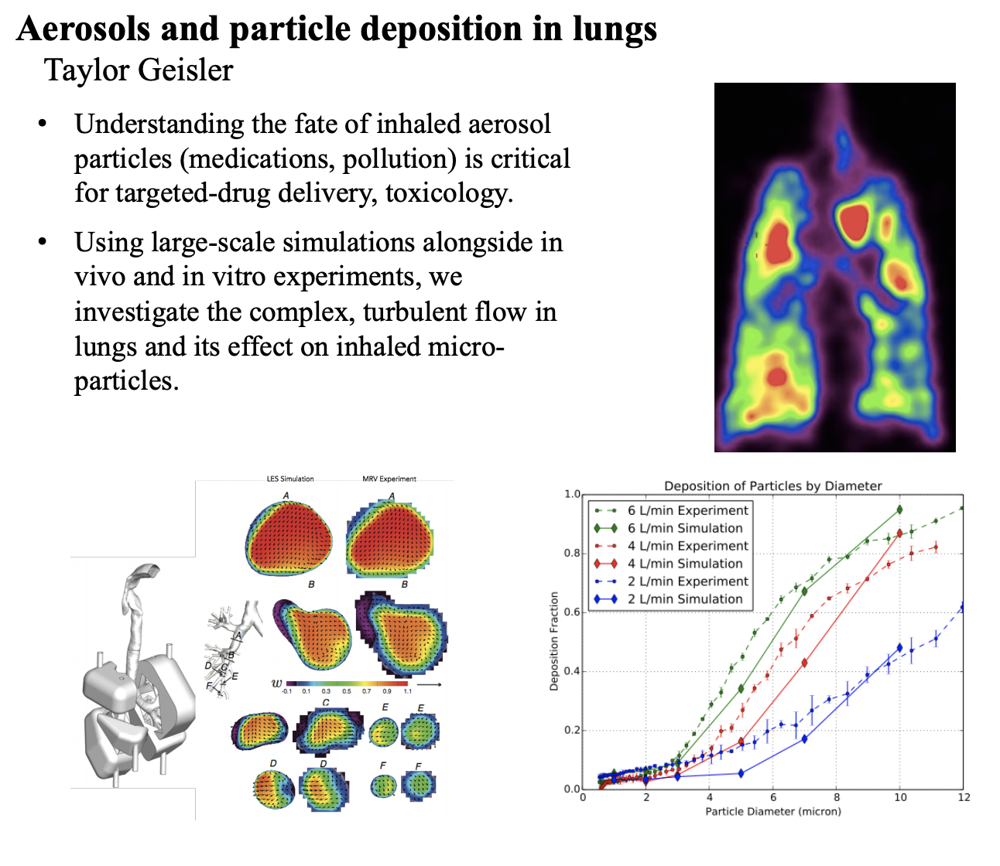

+++
title = "Numerical modeling of airflow in the lungs"
date = 2019-06-13T13:24:41-07:00
draft = false

# Tags: can be used for filtering projects.
# Example: `tags = ["machine-learning", "deep-learning"]`
tags = ["Numerical Simulations"]

# Project summary to display on homepage.
summary = "Used Large Eddy Simulation to simulate particle-fluid dynamics in realistic upper airway models"
+++

https://shaqfehgroup.stanford.edu/research/project-example

