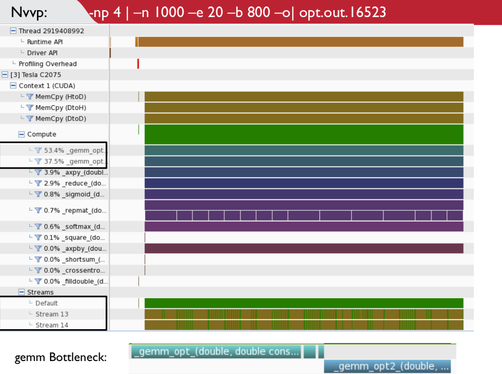

+++
title = "Parallel Neural Net Training"
date = 2019-06-13T13:25:09-07:00
draft = false

# Tags: can be used for filtering projects.
# Example: `tags = ["machine-learning", "deep-learning"]`
tags = ["Machine Learning"]

# Project summary to display on homepage.
summary = "Wrote code to train a neural network for performing computer vision tasks on many GPUs in parallel using C, CUDA."

external_link = "files/cnn_project.pdf"

+++

[Read the PDF](./cnn_project.pdf)
