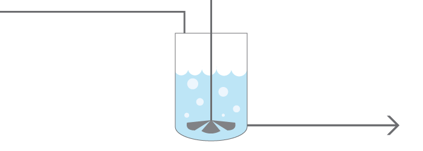

+++
title = "Reaction Simulation Javascript Educational App"
date = 2019-06-13T12:54:25-07:00
draft = false

# Tags: can be used for filtering projects.
# Example: `tags = ["machine-learning", "deep-learning"]`
tags = ["Numerical Simulations"]

# Project summary to display on homepage.
summary = "A chemical reaction simulator created using javascript."
+++

https://sutherland.che.utah.edu/teaching/educational-apps/isothermal-cstr/

